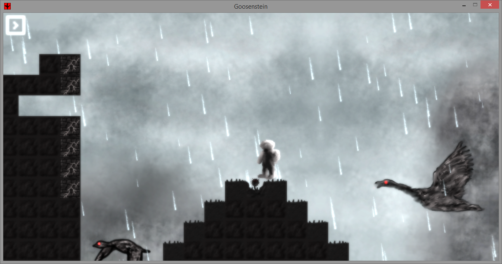

Goosenstein 1.0
===============

[Goosenstein](https://github.com/Uberi/Goosenstein#readme) is a lovely 2D sidescroller, written for HackWATERLOO 2014.

Geese! Blocks! Unintentional features!

Novel yet beautiful, bizarre yet familiar, Goosenstein is a new way of appreciating our evil feathered friends.

Description
-----------

The Canadian goose is a haunting and intriguing creature.

Known to reach wingspans of over 50 meters, and in multiple confirmed sightings, to breathe fire, the "common goose" is a near-mythical creature the abilities of which are almost completely unknown.

Goosenstein pits a harried uWaterloo stundent against an unstoppable force of nature - the majestic, terrifying _Goose_.

Running It
----------

Goosenstein requires a computer with modern video hardware, supporting a relatively recent version of GLSL.

### Windows

1. Download `Goosenstein Windows 32-bit.zip` from the [RELEASES PAGE](https://github.com/Uberi/Goosenstein/releases).
2. Extract the archive somewhere safe.
3. In the `Goosenstein` folder, run `Goosenstein.exe`.
4. Play!

### Linux/Mac

1. Download and install LOVE2d from the [official website](http://love2d.org/).
2. Download `Goosenstein LOVE.zip` from the [RELEASES PAGE](https://github.com/Uberi/Goosenstein/releases).
3. Extract the archive somewhere safe.
4. In the `Goosenstein` folder, run `Goosenstein.love` using LOVE2d.
5. Play!

Credits
-------

    Anthony Zhang    - Lead Developer
    Nerman Nicholas  - Level Design/Developer
    Matas Empakeris  - Developer/Research/Level Design
    Ankit Curchorcar - #GraphicDesigner
    Elvin Yung       - Master Race Troll

Special Thanks to Dan Wolczuk for narration!

License
-------

Copyright 2014 Anthony Zhang (Uberi), Nerman Nicholas (iamnermann), Matas Empakeris (caliskimmer), Ankit Curchocar (kodemankit).

This mod is licensed under the [GNU Affero General Public License](http://www.gnu.org/licenses/agpl-3.0.html).

Basically, this means everyone is free to use, modify, and distribute the files, as long as these modifications are also licensed the same way.

Most importantly, the Affero variant of the GPL requires you to publish your modifications in source form, even if the program is run only on the server, and not distributed.
